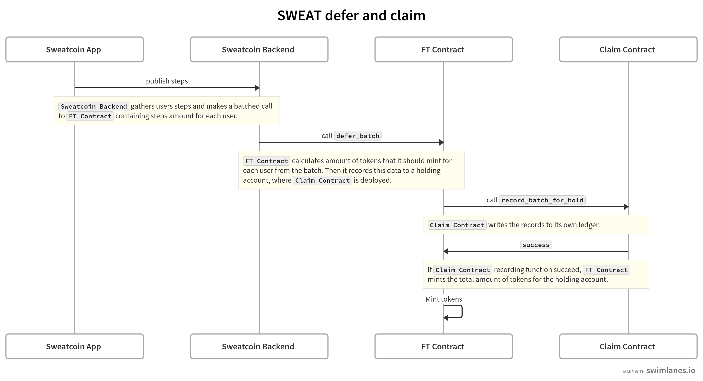

# SWEAT the TOKEN

#### 📦 Dependencies

- Install near-cli: `npm install -g near-cli`
- Install Rust (>= 1.60.0) `curl --proto '=https' --tlsv1.2 -sSf https://sh.rustup.rs | sh`
- `rustup target add wasm32-unknown-unknown`

#### Build & Run tests

```rust
./sweat/build.sh
//The wasm file will be at `res/sweat.wasm`

cargo test -- --nocapture
cargo run --example mint
cargo run --example transfer
cargo run --example formula
```

## Usage

```bash
export TOKEN_ACCOUNT_ID=your-token-account-id
```

Deploy and initialize the contract:

```bash
near deploy --accountId=$TOKEN_ACCOUNT_ID --wasmFile=res/sweat.wasm --initArgs '{"postfix": ".u.sweat.testnet"}' --initFunction new
```

Add an oracle

```bash
export ORACLE_ACCOUNT_ID=your-oracle-account-id
```

```bash
near call $TOKEN_ACCOUNT_ID add_oracle `{"account_id":"${ORACLE_ACCOUNT_ID}"}` --accountId $TOKEN_ACCOUNT_ID --gas=2428088695050
near view sweat_testing_11.testnet get_oracles
[ 'your-oracle-account-id' ]
```

Call view methods

```bash
near view $TOKEN_ACCOUNT_ID get_steps_from_tge
'0'

near view $TOKEN_ACCOUNT_ID formula '{"steps_from_tge":"1", "steps":1000}'
'999999999912699776'

near view $TOKEN_ACCOUNT_ID ft_balance_of '{"account_id":"some-random-account.testnet"}'
'0'
```

Send steps as an Oracle

```bash
near call $TOKEN_ACCOUNT_ID record_batch '{"steps_batch": [["random-guy-1.testnet", 10000],["random-gal-2.testnet", 20000] ]}' --accountId $ORACLE_ACCOUNT_ID --gas=300000000000000
```

Transfer tokens

```bash
# not necessarily $ORACLE_ACCOUNT_ID, can be any local account
near call $TOKEN_ACCOUNT_ID ft_transfer '{"receiver_id":"<receiver id>", "amount":"100", "memo":"hello world!"}' --accountId $ORACLE_ACCOUNT_ID --depositYocto 1
```

Pay for storage

```bash
# not necessarily $ORACLE_ACCOUNT_ID, can be any local account
near call $TOKEN_ACCOUNT_ID storage_deposit '{"account_id":"random-guy-1.testnet"}' --accountId $ORACLE_ACCOUNT_ID --depositYocto 2350000000000000000000

near view $TOKEN_ACCOUNT_ID storage_balance_of '{"account_id":"random-guy-1.testnet"}' --accountId $ORACLE_ACCOUNT_ID
```

Mint tokens

```bash
near call $TOKEN_ACCOUNT_ID mint_tge '{"amount":"100", "account_for":"<account_for>"}' --accountId $TOKEN_ACCOUNT_ID --gas=300000000000000
```

### Deferring tokens



For information about claiming tokens from Holding account refer to the [Sweat Claim repo](https://github.com/sweatco/sweat-claim). 
